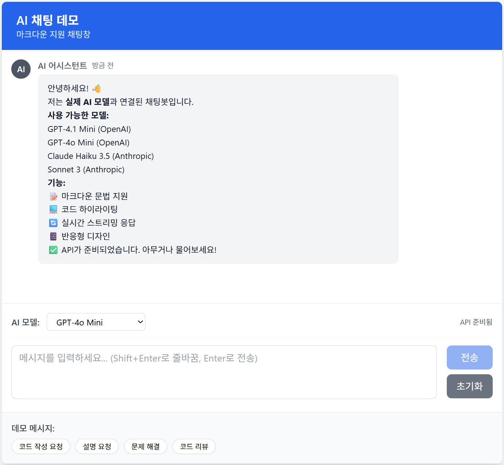

# AI 채팅 데모

Vue.js 2 기반의 **실제 AI 모델 연동** 채팅 인터페이스로 마크다운 렌더링과 코드 하이라이팅을 지원합니다.

## 주요 기능

- 🎨 **현대적인 UI**: Tailwind CSS를 사용한 반응형 디자인
- 🤖 **실제 AI 연동**: OpenAI GPT와 Anthropic Claude 모델 지원
- � **실시간 스트리밍**: AI 응답의 실시간 타이핑 효과
- �📝 **마크다운 지원**: marked 라이브러리를 사용한 실시간 마크다운 렌더링
- 🌈 **코드 하이라이팅**: highlight.js를 사용한 다양한 언어 지원
- 💬 **대화형 채팅**: 사용자와 AI 메시지 구분 및 컨텍스트 유지
- 📱 **모바일 친화적**: 모든 디바이스에서 최적화된 경험
- 📋 **메시지 관리**: 복사하기, 삭제, 새로고침 기능 지원
- ⚙️ **모델 선택**: 드롭다운으로 AI 모델 실시간 변경
- 🔐 **환경 변수**: .env 파일을 통한 안전한 API 키 관리
- 👤 **사용자 인증**: 회원가입, 로그인, 게스트 로그인 지원
- 💾 **채팅 세션 복원**: 새로고침 시 마지막 채팅방 자동 복원
- 🗂️ **다중 채팅방**: 여러 채팅방 생성 및 관리, 즐겨찾기 기능
- 🎛️ **사이드바 토글**: 부드러운 애니메이션과 함께 사이드바 숨기기/보기
- 🔍 **메시지 검색**: Fuse.js 기반 퍼지 검색으로 채팅 히스토리 검색

## 기술 스택

- **Frontend**: Vue.js 2.6.14
- **상태 관리**: Vuex 3.6.2 (auth, chat 모듈)
- **스타일링**: Tailwind CSS 3.3.2
- **마크다운**: marked 4.3.0
- **코드 하이라이팅**: highlight.js 11.8.0
- **AI API**: OpenAI GPT, Anthropic Claude
- **HTTP 클라이언트**: Fetch API (스트리밍 지원)
- **인증**: 로컬 스토리지 기반 사용자 관리
- **암호화**: crypto-js (비밀번호 해싱)
- **검색**: Fuse.js (퍼지 검색), mark.js (텍스트 하이라이팅), lodash (디바운싱)
- **빌드 도구**: Vue CLI 5.0.0

## 프로젝트 설정

### 환경 변수 설정

프로젝트 루트에 `.env` 파일을 생성하고 API 키를 설정하세요:

```env
# OpenAI API 키
VUE_APP_OPENAI_API_KEY=your_openai_api_key_here

# Anthropic API 키  
VUE_APP_ANTHROPIC_API_KEY=your_anthropic_api_key_here

# API 엔드포인트 (선택사항)
VUE_APP_OPENAI_API_URL=https://api.openai.com/v1/chat/completions
VUE_APP_ANTHROPIC_API_URL=https://api.anthropic.com/v1/messages
```

### 의존성 설치

```bash
npm install
```

### 개발 서버 실행

```bash
npm run serve
```

### 프로덕션 빌드

```bash
npm run build
```

## 지원 AI 모델

### OpenAI 모델
- **GPT-4o Mini**: 빠르고 효율적인 최신 모델
- **GPT-4.1 Mini**: 개선된 성능의 소형 모델

### Anthropic 모델  
- **Claude 3.5 Haiku**: 빠른 응답 속도의 경량 모델
- **Claude 3.5 Sonnet**: 균형잡힌 성능의 범용 모델

## 사용법

### 사용자 인증
1. **회원가입**: 이메일과 비밀번호로 새 계정 생성
2. **로그인**: 기존 계정으로 로그인
3. **게스트 로그인**: 임시 계정으로 빠른 시작
4. **세션 유지**: 새로고침 시 자동 로그인 및 마지막 채팅방 복원

### 채팅방 관리
1. **새 채팅방 생성**: 사이드바의 "새 채팅" 버튼 클릭
2. **채팅방 전환**: 사이드바에서 채팅방 클릭으로 전환
3. **채팅방 이름 변경**: 채팅방 제목 더블클릭 또는 우클릭 메뉴
4. **즐겨찾기**: 채팅방에 즐겨찾기 추가/제거
5. **색상 테마**: 채팅방별 색상 설정
6. **채팅방 삭제**: 우클릭 메뉴에서 삭제 선택
7. **사이드바 토글**: 헤더의 햄버거 메뉴 버튼 또는 `Ctrl+B` 키로 사이드바 숨기기/보기

### 메시지 검색
1. **검색 모드 진입**: 헤더의 검색 아이콘 클릭 또는 `Ctrl+F` 키
2. **검색어 입력**: 검색창에 키워드 입력 (자동 완성 지원)
3. **결과 확인**: 검색 결과 개수와 일치도가 표시됨
4. **결과 선택**: 검색 결과 클릭 시 해당 채팅방으로 이동하고 메시지 하이라이트
5. **검색 종료**: 채팅 아이콘 클릭으로 일반 채팅 모드로 복귀

### 기본 사용
1. **API 키 설정**: `.env` 파일에 OpenAI 또는 Anthropic API 키를 설정하세요
2. **모델 선택**: 입력 영역 상단의 드롭다운에서 사용할 AI 모델을 선택하세요
3. **메시지 입력**: 하단 텍스트 영역에 메시지를 입력하세요
4. **실시간 응답**: AI가 실시간 스트리밍으로 응답을 생성합니다

### 마크다운 지원
다음과 같은 마크다운 문법을 사용할 수 있습니다:
   - `**굵은 글씨**`
   - `*기울임 글씨*`
   - `` `인라인 코드` ``
   - 코드 블록 (```언어명)
   - 목록, 인용문, 헤더 등

### 키보드 단축키
   - `Enter`: 메시지 전송
   - `Shift + Enter`: 줄바꿈
   - `Ctrl + B` (또는 `Cmd + B`): 사이드바 토글
   - `Ctrl + F` (또는 `Cmd + F`): 메시지 검색 모드 토글

### 메시지 관리
   - 메시지에 마우스를 올리면 액션 버튼 표시
   - 📋 **복사 버튼**: 메시지 내용을 클립보드에 복사
   - 🗑️ **삭제 버튼**: AI 메시지 삭제 (AI 메시지에만 표시)
   - 🔄 **새로고침 버튼**: 같은 질문에 대한 새로운 AI 답변 생성

### 데모 기능
   - 하단의 데모 버튼을 클릭하여 예제를 확인하세요
   - 코드 작성, 설명 요청, 문제 해결, 코드 리뷰 등의 샘플 제공

## 지원하는 마크다운 문법

### 텍스트 스타일
- **굵은 글씨**: `**텍스트**`
- *기울임 글씨*: `*텍스트*`
- `인라인 코드`: `` `코드` ``

### 코드 블록
```javascript
function example() {
  console.log("Hello, World!");
}
```

### 목록
- 순서 없는 목록: `- 항목`
- 순서 있는 목록: `1. 항목`

### 인용문
> 인용문은 `>` 기호로 시작합니다

### 헤더
```markdown
# H1 헤더
## H2 헤더
### H3 헤더
```

## 지원하는 프로그래밍 언어

highlight.js를 통해 다음 언어들의 코드 하이라이팅을 지원합니다:

- JavaScript
- Python
- Java
- C/C++
- HTML/CSS
- JSON
- Markdown
- SQL
- 그 외 100+ 언어

## 커스터마이징

### 테마 변경
`src/styles/tailwind.css` 파일에서 색상과 스타일을 수정할 수 있습니다.

### 코드 하이라이팅 테마 변경
`src/main.js`에서 highlight.js 테마를 변경할 수 있습니다:

```javascript
// 다른 테마 예시
import 'highlight.js/styles/atom-one-dark.css'
import 'highlight.js/styles/vs2015.css'
```

## 폴더 구조

```
src/
├── components/
│   ├── auth/
│   │   ├── AuthModal.vue     # 인증 모달 (로그인/회원가입)
│   │   └── UserProfile.vue   # 사용자 프로필 컴포넌트
│   ├── ChatMessage2.vue      # 채팅 메시지 컴포넌트
│   └── ChatSidebar.vue       # 채팅방 목록 사이드바
├── services/
│   └── apiService.js         # AI API 통신 서비스
├── store/
│   ├── modules/
│   │   ├── auth.js          # 사용자 인증 Vuex 모듈
│   │   └── chat.js          # 채팅 관리 Vuex 모듈
│   └── index.js             # Vuex 스토어 설정
├── styles/
│   └── tailwind.css          # Tailwind CSS 설정
├── App.vue                   # 메인 앱 컴포넌트
├── main.js                  # 앱 진입점
└── .env                     # 환경 변수 파일 (API 키)
```

## 핵심 컴포넌트

### App.vue
- 메인 채팅 인터페이스
- AI 모델 선택 기능
- 메시지 상태 관리
- API 통신 조율
- 사용자 인증 상태 관리

### 인증 컴포넌트
#### AuthModal.vue
- 로그인/회원가입 모달
- 이메일/비밀번호 유효성 검사
- 게스트 로그인 기능

#### UserProfile.vue
- 사용자 프로필 표시
- 로그아웃 기능
- 사용자 설정 관리

### ChatSidebar.vue
- 채팅방 목록 및 관리
- 새 채팅방 생성 기능
- 채팅방 이름 편집 (더블클릭)
- 즐겨찾기 기능
- 채팅방 색상 테마 설정
- 컨텍스트 메뉴 (우클릭)
- 최근 활동순/즐겨찾기순 정렬

### SearchSidebar.vue
- Fuse.js 기반 퍼지 검색 엔진
- 실시간 검색 결과 표시 (디바운싱 적용)
- 검색어 하이라이팅 및 일치도 표시
- 검색 결과 클릭 시 해당 메시지로 이동
- 채팅방 제목 및 메시지 내용 통합 검색

### ChatMessage2.vue  
- 개별 채팅 메시지 렌더링
- 마크다운 파싱 및 코드 하이라이팅
- 메시지 액션 버튼 (복사, 삭제, 새로고침)
- 스트리밍 중 로딩 상태 표시

### Vuex 모듈
#### auth.js
- 사용자 인증 상태 관리
- 회원가입, 로그인, 로그아웃 액션
- 세션 복원 및 마지막 채팅방 기억
- 사용자 설정 관리

#### chat.js
- 채팅방 및 메시지 상태 관리
- 메시지 추가, 수정, 삭제
- 채팅방 생성 및 관리
- 마지막 채팅방 복원

### apiService.js
- OpenAI 및 Anthropic API 통신
- 실시간 스트리밍 응답 처리
- API 키 검증
- 에러 핸들링

## 컴포넌트 버전

### ChatMessage2.vue (현재 사용 중)
- 순수 CSS와 Tailwind CSS 조합 사용
- 실제 AI API 연동 지원
- 스트리밍 응답 로딩 상태 처리
- 복사, 삭제, 새로고침 액션 버튼
- 마크다운 렌더링 및 코드 하이라이팅
- 사용자/AI 메시지 구분 스타일링

### 주요 개선사항
- ✅ 실제 AI 모델 연동 (OpenAI GPT, Anthropic Claude)
- ✅ 실시간 스트리밍 응답
- ✅ 환경 변수를 통한 API 키 관리
- ✅ 모델 선택 드롭다운 (Input Area 배치)
- ✅ 새로고침 버튼으로 답변 재생성
- ✅ 메시지 내부 로딩 처리
- ✅ 대화 컨텍스트 유지 (최근 10개 메시지)
- ✅ 포괄적인 에러 핸들링

### 현재 구현 상태

`App.vue` 파일에서 ChatMessage2 컴포넌트를 사용하도록 설정되어 있습니다:

```javascript 
<template>
  <!-- Chat Messages -->
  <div class="chat-container overflow-y-auto p-4 space-y-4 flex-1 min-h-0" ref="chatContainer">
    <ChatMessage2
      v-for="message in messages"
      :key="message.id"
      :message="message"
      @delete-message="deleteMessage"
      @refresh-message="refreshMessage"
    />
  </div>
</template>         

<script>
import ChatMessage2 from './components/ChatMessage2.vue'
import apiService from './services/apiService.js'

export default {
  name: 'App',
  components: {
    ChatMessage2
  },
  // ... 실제 AI 연동 로직
}
</script>
```

## 향후 계획

### 🚀 단기 개선사항 (1-2주)
- [x] **사용자 인증**: 사용자별 채팅 히스토리 저장
- [x] **채팅 세션 복원**: 마지막 접근 채팅방 자동 복원
- [x] **여러 채팅방 생성 및 관리**: 채팅방 목록 UI 및 관리 기능
- [x] **Vuex 상태 관리 개선**: 채팅방 편집 시 상태 변이 오류 해결
- [x] **사이드바 토글**: 부드러운 애니메이션과 키보드 단축키 지원
- [x] **메시지 검색**: Fuse.js 기반 퍼지 검색과 하이라이팅 기능
- [ ] **파일 업로드**: 이미지 및 문서 파일 업로드 지원
- [ ] **다크 모드**: 어두운 테마 지원

### 🛠️ 중기 개선사항 (1-2개월)
- [ ] **음성 입력**: Speech-to-Text API 연동
- [ ] **음성 출력**: Text-to-Speech로 AI 답변 읽기
- [ ] **채팅 내보내기**: PDF, Markdown 형식으로 대화 내용 저장
- [ ] **플러그인 시스템**: 커스텀 기능 확장 지원
- [ ] **실시간 협업**: 여러 사용자가 같은 채팅에 참여

### 🔬 장기 개선사항 (3-6개월)
- [ ] **멀티모달 지원**: 이미지 분석 및 생성 기능
- [ ] **워크플로우 자동화**: 반복 작업 자동화 템플릿
- [ ] **AI 에이전트**: 특화된 도메인별 AI 어시스턴트
- [ ] **모바일 앱**: React Native 또는 Flutter로 모바일 버전
- [ ] **Enterprise 기능**: 팀 관리, 사용량 분석, 보안 강화

### 🔧 기술적 개선사항
- [ ] **Vue 3 마이그레이션**: Composition API 및 최신 기능 활용
- [ ] **TypeScript 도입**: 타입 안정성 및 개발 경험 향상
- [ ] **PWA 지원**: 오프라인 사용 및 앱 설치 기능
- [ ] **성능 최적화**: 가상 스크롤링, 메모리 관리 개선
- [ ] **테스트 코드**: 단위 테스트 및 E2E 테스트 추가

### 📊 분석 및 모니터링
- [ ] **사용자 분석**: 채팅 패턴 및 사용 통계
- [ ] **성능 모니터링**: API 응답 시간 및 에러 추적
- [ ] **A/B 테스팅**: UI/UX 개선을 위한 실험 프레임워크
- [ ] **피드백 시스템**: 사용자 만족도 및 개선 요청 수집

## 데이터 저장 구조

### localStorage 키
- `ai_chat_users`: 사용자 정보 및 설정
- `ai_chat_histories`: 사용자별 채팅 히스토리
- `ai_chat_sessions`: 사용자 세션 정보

### sessionStorage 키
- `ai_chat_current_session`: 현재 로그인 세션

### 사용자 데이터 구조
```javascript
{
  id: "user_xxx",
  email: "user@example.com",
  nickname: "사용자명",
  avatar: "아바타 URL",
  lastChatId: "chat_xxx",  // 마지막 접근 채팅방
  preferences: {
    defaultModel: "gpt-4o-mini",
    theme: "light"
  },
  createdAt: "2025-08-02T...",
  lastLoginAt: "2025-08-02T..."
}
```

### 채팅 데이터 구조
```javascript
{
  id: "chat_xxx",
  title: "채팅 제목",
  isFavorite: false,           // 즐겨찾기 여부
  color: "#3B82F6",           // 채팅방 색상 (선택사항)
  settings: {
    model: "gpt-4o-mini",     // AI 모델
    systemPrompt: "",         // 시스템 프롬프트
    temperature: 0.7          // 온도 설정
  },
  messages: [
    {
      id: "msg_xxx",
      content: "메시지 내용",
      sender: "user" | "ai",
      timestamp: "2025-08-02T...",
      model: "gpt-4o-mini"
    }
  ],
  createdAt: "2025-08-02T...",
  updatedAt: "2025-08-02T..."
}
```

## 데모 화면



*실제 OpenAI GPT 및 Anthropic Claude 모델과 연동된 라이브 채팅 인터페이스*

## 문제 해결

### API 키 관련 문제
- `.env` 파일이 프로젝트 루트에 있는지 확인
- API 키가 유효한지 확인
- 개발 서버를 재시작 (`npm run serve`)

### 스트리밍 응답 문제
- 네트워크 연결 상태 확인
- 브라우저 콘솔에서 에러 메시지 확인
- API 사용량 한도 확인

### 모델 선택 문제
- 선택한 모델이 API 키와 호환되는지 확인
- OpenAI 모델은 OpenAI 키, Anthropic 모델은 Anthropic 키 필요

### Vuex 상태 관리 문제
- Vuex 스토어 상태를 직접 변경하지 않고 mutation 사용
- 채팅방 편집 상태는 컴포넌트 내부에서 관리하여 상태 변이 오류 방지
- 개발자 도구에서 Vuex 상태 변이 경고 발생 시 컴포넌트 로직 확인

## 라이선스

MIT License  


