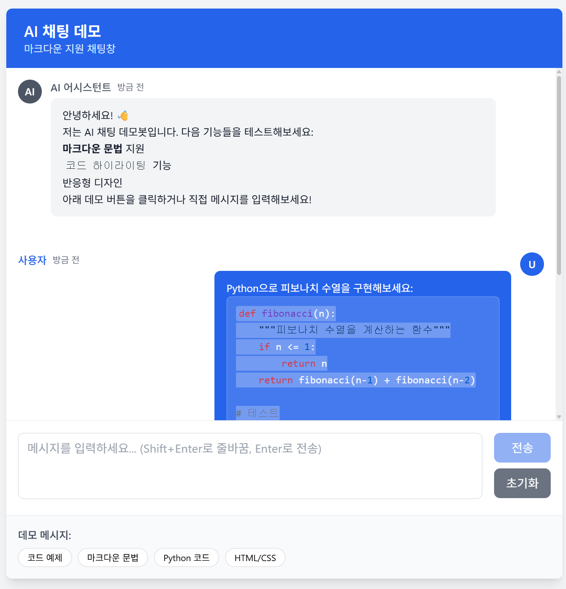

# AI 채팅 데모

Vue.js 2 기반의 AI 채팅 인터페이스로 마크다운 렌더링과 코드 하이라이팅을 지원합니다.

## 주요 기능

- 🎨 **현대적인 UI**: Tailwind CSS를 사용한 반응형 디자인
- 📝 **마크다운 지원**: marked 라이브러리를 사용한 실시간 마크다운 렌더링
- 🌈 **코드 하이라이팅**: highlight.js를 사용한 다양한 언어 지원
- 💬 **실시간 채팅**: 사용자와 AI 메시지 구분 표시
- 📱 **모바일 친화적**: 모든 디바이스에서 최적화된 경험
- ⚡ **타이핑 애니메이션**: AI 응답 시 실시간 타이핑 효과
- 📋 **메시지 관리**: 복사하기, 삭제 기능 지원
- 🎯 **이중 컴포넌트**: Tailwind CSS 버전과 순수 CSS 버전 제공

## 기술 스택

- **Frontend**: Vue.js 2.6.14
- **스타일링**: Tailwind CSS 3.3.2
- **마크다운**: marked 4.3.0
- **코드 하이라이팅**: highlight.js 11.8.0
- **빌드 도구**: Vue CLI 5.0.0

## 프로젝트 설정

### 의존성 설치

```bash
npm install
```

### 개발 서버 실행

```bash
npm run serve
```

### 프로덕션 빌드

```bash
npm run build
```

## 사용법

1. **메시지 입력**: 하단 텍스트 영역에 메시지를 입력하세요
2. **마크다운 지원**: 다음과 같은 마크다운 문법을 사용할 수 있습니다:
   - `**굵은 글씨**`
   - `*기울임 글씨*`
   - `` `인라인 코드` ``
   - 코드 블록 (```언어명)
   - 목록, 인용문, 헤더 등

3. **데모 메시지**: 하단의 데모 버튼을 클릭하여 예제를 확인하세요
4. **키보드 단축키**:
   - `Enter`: 메시지 전송
   - `Shift + Enter`: 줄바꿈

5. **메시지 관리**:
   - 메시지에 마우스를 올리면 액션 버튼 표시
   - 📋 복사 버튼: 메시지 내용을 클립보드에 복사
   - 🗑️ 삭제 버튼: AI 메시지 삭제 (AI 메시지에만 표시)

## 지원하는 마크다운 문법

### 텍스트 스타일
- **굵은 글씨**: `**텍스트**`
- *기울임 글씨*: `*텍스트*`
- `인라인 코드`: `` `코드` ``

### 코드 블록
```javascript
function example() {
  console.log("Hello, World!");
}
```

### 목록
- 순서 없는 목록: `- 항목`
- 순서 있는 목록: `1. 항목`

### 인용문
> 인용문은 `>` 기호로 시작합니다

### 헤더
```markdown
# H1 헤더
## H2 헤더
### H3 헤더
```

## 지원하는 프로그래밍 언어

highlight.js를 통해 다음 언어들의 코드 하이라이팅을 지원합니다:

- JavaScript
- Python
- Java
- C/C++
- HTML/CSS
- JSON
- Markdown
- SQL
- 그 외 100+ 언어

## 커스터마이징

### 테마 변경
`src/styles/tailwind.css` 파일에서 색상과 스타일을 수정할 수 있습니다.

### 코드 하이라이팅 테마 변경
`src/main.js`에서 highlight.js 테마를 변경할 수 있습니다:

```javascript
// 다른 테마 예시
import 'highlight.js/styles/atom-one-dark.css'
import 'highlight.js/styles/vs2015.css'
```

## 폴더 구조

```
src/
├── components/
│   ├── ChatMessage.vue    # 채팅 메시지 컴포넌트 (Tailwind CSS 버전)
│   └── ChatMessage2.vue   # 채팅 메시지 컴포넌트 (순수 CSS 버전)
├── styles/
│   └── tailwind.css       # Tailwind CSS 설정
├── App.vue                # 메인 앱 컴포넌트
└── main.js               # 앱 진입점
```

## 컴포넌트 버전

### ChatMessage.vue (Tailwind CSS 버전)
- Tailwind CSS 클래스 사용
- 반응형 디자인
- 유틸리티 클래스 기반 스타일링

### ChatMessage2.vue (순수 CSS 버전)
- Tailwind CSS 없이 순수 CSS 사용
- 동일한 기능과 디자인
- 커스텀 CSS 클래스 사용
- Tailwind CSS 의존성 없이 독립적으로 사용 가능

두 컴포넌트는 동일한 API와 기능을 제공하므로 필요에 따라 교체하여 사용할 수 있습니다.

### ChatMessage vs ChatMessage2 교체

`App.vue` 파일을 아래와 같이 교체한다.

```javascript 
<Template>
        <!-- Chat Messages -->
        <div
          class="chat-container h-96 overflow-y-auto p-4 space-y-4"
          ref="chatContainer"
        >
          <!-- ChatMessage vs ChatMessage2 교체 -->
          <ChatMessage2
            v-for="message in messages"
            :key="message.id"
            :message="message"
            @delete-message="deleteMessage"
          />
         ...
</Template>         
<script>
//import ChatMessage from './components/ChatMessage.vue'
import ChatMessage2 from './components/ChatMessage2.vue'
export default {
  name: 'App',
  components: {
    ChatMessage2
  },
  ...
}
</script>
```

## 데모 화면



## 라이선스

MIT License

## 기여하기

1. Fork the Project
2. Create your Feature Branch (`git checkout -b feature/AmazingFeature`)
3. Commit your Changes (`git commit -m 'Add some AmazingFeature'`)
4. Push to the Branch (`git push origin feature/AmazingFeature`)
5. Open a Pull Request
